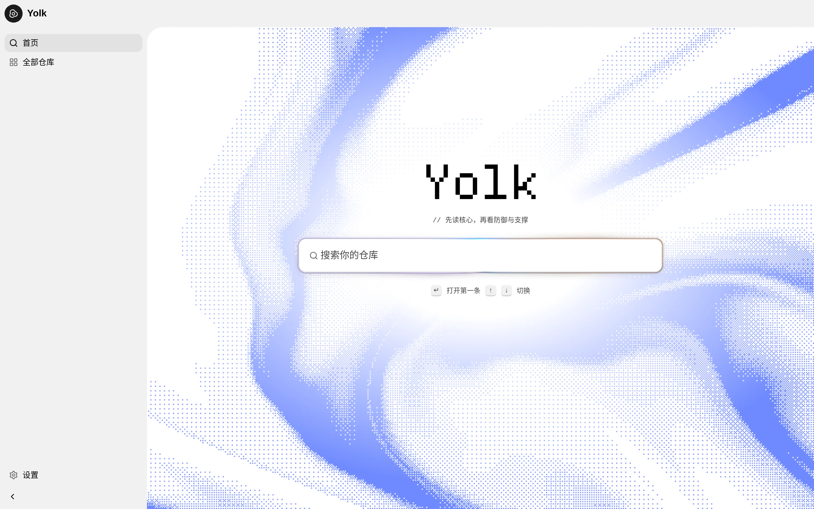
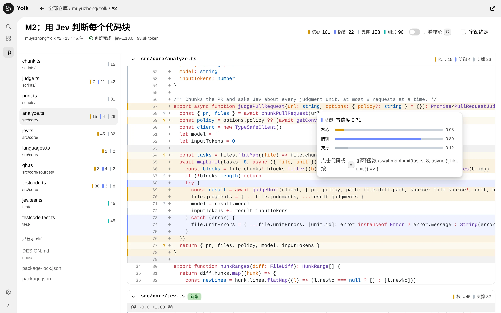
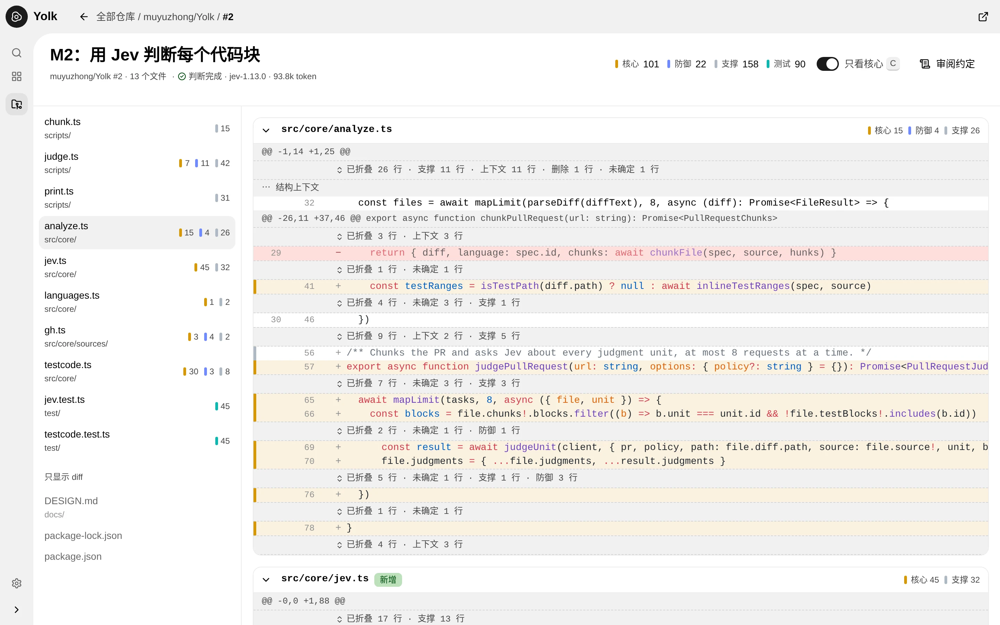
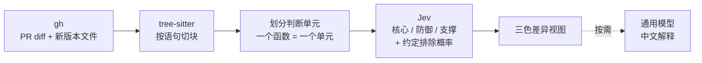

<div align="center">

<picture>
  <source media="(prefers-color-scheme: dark)" srcset="docs/images/landing-dark.webp">
  
</picture>

# Yolk

**先读核心，再看防御与支撑。**

一个桌面 PR 审阅透镜：把 PR 的新增代码按语法切块，交给 Jev 判断每块是 **核心**、**防御** 还是 **支撑**，<br>
在三色差异视图里先把核心路径读懂，其余部分按需展开。

[](https://github.com/muyuzhong/Yolk/releases)


[下载安装](#下载安装) · [使用方式](#使用方式) · [工作原理](#工作原理) · [源码开发](#源码开发) · [设计文档](docs/DESIGN.md)

</div>

---

## 为什么做 Yolk

团队的代码越来越多由 AI 编写，但每个人仍要对自己提交的代码负责。AI 写的代码很少有 bug，问题大多出在"合不合适"：模型常常写一大堆防御性代码，而项目当前阶段根本用不上。逐行读这些代码费时费力，有时还得读自己不熟悉的语言。

Yolk 把每一行新增代码放进三个类别里，让审阅者先抓主干：

| | 类别 | 含义 |
| :-: | --- | --- |
| 🟨 | **核心** | PR 真正要做的事；删掉它，正常路径就断了 |
| 🟦 | **防御** | 只在出错时才起作用：校验、错误处理、重试、超时、降级、空值守卫 |
| ⬜ | **支撑** | 不改变行为：日志、类型、import、接线、样板、配置 |
| 🟩 | **测试** | 按路径和 `#[cfg(test)]` 等标注直接识别，不交给模型判断 |

> 琥珀色的核心就像蛋黄——这也是 Yolk 这个名字的由来。

## 界面一览

<picture>
  <source media="(prefers-color-scheme: dark)" srcset="docs/images/review-dark.webp">
  
</picture>

<p align="center"><sub>三色差异视图：左侧色条标出类别，拿不准的块画淡并加 <code>?</code>；悬停显示 Jev 的概率分布，点击或按 <kbd>E</kbd> 让通用模型用中文解释所在函数。</sub></p>

<picture>
  <source media="(prefers-color-scheme: dark)" srcset="docs/images/core-only-dark.webp">
  
</picture>

<p align="center"><sub>按 <kbd>C</kbd> 打开"只看核心"：只保留核心代码和它所在的语法结构，其余折叠成可展开的摘要行。</sub></p>

## 功能

- **三色差异视图** —— 每判断完一个单元就上色，颜色逐步铺满，不用等全部结果
- **只看核心** —— 核心代码连同外层函数、类等结构一起保留，防御 / 支撑 / 测试 / 删除行折叠，点击即可展开
- **置信度可见** —— 模型拿不准的块画淡并标 `?`，提示"这块值得亲自看看"
- **审阅约定** —— 用自然语言写下项目当前阶段不需要什么（默认一份，也可按仓库单独写），被约定排除的代码标上 ✂
- **按需解释** —— 点击代码或按 <kbd>E</kbd> 解释所在函数；用鼠标划选几行（可跨块、含删除行）后按 <kbd>E</kbd> 只解释选中部分
- **可调的判断标准** —— 在设置里改写三类代码的定义、拖动 ✂ 和 `?` 的阈值，调整后立即生效
- **本地运行** —— 通过 `gh` 的登录状态读取 PR，私有仓库和 GitHub Enterprise 直接可用；API key 用系统钥匙串加密保存
- **判断缓存** —— 每个单元的判断结果缓存在本机，重新打开同一个 PR 不重复计费

## 下载安装

到 [GitHub Releases](https://github.com/muyuzhong/Yolk/releases) 下载对应系统和处理器的安装包，无需安装 Node.js。

| 系统 | 处理器 | 文件 |
| --- | --- | --- |
| macOS | Apple Silicon：arm64；Intel：x64 | `.dmg`（拖入 Applications）或 `.zip` |
| Windows | Intel/AMD：x64；Windows on ARM：arm64 | `.exe` 安装程序 |
| Linux（含 Arch） | Intel/AMD：x64；ARM64：arm64 | `.AppImage` 或 `.tar.gz` |
| Ubuntu / Debian | x64 / arm64 | `.deb` |
| Fedora / RPM 系发行版 | x64 / arm64 | `.rpm` |

> [!NOTE]
> 当前是预发布版本。初期版本未配置代码签名及 Apple 公证，macOS / Windows 可能提示未知开发者；受组织安全策略管理的电脑可能无法运行。请从本仓库下载，并核对 Release 中的 `SHA256SUMS`。

### 前置条件：GitHub CLI

客户端通过 [GitHub CLI](https://cli.github.com/) 读取 PR 列表、diff 和文件内容，需要先安装并登录：

```bash
# Arch Linux
sudo pacman -S github-cli
# macOS（Homebrew）
brew install gh
# Windows（PowerShell；自动选择系统架构）
winget install --id GitHub.cli --exact

gh auth login
```

### 配置模型

Yolk 用两个模型，各司其职，都在客户端的**设置**里填写：

| | 用途 | 需要填写 |
| --- | --- | --- |
| **Jev**（[TypeSafe](https://docs.typesafe.ai)） | 判断每个块的类别、是否被约定排除 | API Key（模型默认 `jev-latest`） |
| **通用模型**（任意 OpenAI 兼容接口） | 按需生成中文解释 | Base URL、API Key、模型名 |

两个 API key 都用 Electron 的 safeStorage 加密保存，只在主进程里使用。Linux 保存 key 需要可用的系统密钥环（例如已解锁的 GNOME Keyring / KDE Wallet）。

<details>
<summary><b>Linux 运行提示</b></summary>

- AppImage 下载后先 `chmod +x Yolk-*.AppImage`，再双击或从终端运行。
- 若提示缺少 `libfuse.so.2`：Arch 安装 `fuse2`，或使用 `./Yolk-*.AppImage --appimage-extract-and-run`。
- `.tar.gz` 解压后运行其中的 `yolk`。
- 应用使用 Electron 默认的 Wayland / X11 选择，必要时可加 `--ozone-platform=x11` 排查显示问题。
- 从桌面图标启动不一定能读取终端中设置的环境变量，建议在设置里直接填写 key。

</details>

## 使用方式

1. 在首页的搜索框里选一个仓库，也可以输入 `owner/repo`、仓库链接，或者直接粘贴 PR 链接。
2. 从仓库的 PR 列表里选一个 PR；请你审阅的 PR 排在最上面。
3. 在审阅页里读代码：

| 快捷键 | 作用 |
| --- | --- |
| <kbd>C</kbd> | 切换"只看核心" |
| <kbd>E</kbd> | 解释悬停所在的函数；有划选时解释选中的行 |
| <kbd>Esc</kbd> | 关闭解释卡片 |
| 鼠标侧键 / <kbd>Alt</kbd>+<kbd>←</kbd> <kbd>→</kbd> | 后退 / 前进 |

**审阅约定示例**（设置 → 审阅约定）：

```markdown
- MVP 阶段，不需要重试和降级逻辑
- 输入校验只在 API 边界（HTTP handler）做，内部函数不检查参数
- 内部调用不写 try/catch 兜底，错误直接向上抛
- 日志只在请求入口和出错的地方打
```

约定用什么语言写都可以，原文直接交给 Jev。

## 工作原理



- **切块：** 解析 head 版本的完整文件（而不是语法残缺的 diff 片段），以语句级节点为单位切块；函数、`if`、`try` 等复合语句拆成外壳和内部语句，短小的守卫语句和 `catch` 子句整体算一块。
- **判断单元：** 一个有改动的函数，或文件顶层的一段连续改动。函数边界直接复用各语言语法自带的 `tags.scm`；较长的匿名函数（如测试回调）也单独成单元。
- **判断：** 同一单元的所有块在一次 Jev 请求里问完，各单元最多 8 个并发；Jev 返回每个选项的概率和置信度。
- **语言：** 目前验证过 TypeScript / TSX / JavaScript、Python、Rust；其他语言只显示普通 diff。

完整的设计和取舍见 [docs/DESIGN.md](docs/DESIGN.md)。

## 源码开发

需要 Node.js 22+ 和已登录的 `gh`（`gh auth status`）。模型 key 除了在设置里填写，也可以用环境变量：`TYPESAFE_API_KEY`，以及 `OPENAI_BASE_URL`、`OPENAI_API_KEY`、`OPENAI_MODEL`。

```bash
npm install
npm run dev      # 开发模式，支持热更新
```

> 如果 `node_modules/electron/dist` 不存在（Electron 二进制没有随安装脚本下载），运行 `node node_modules/electron/install.js`。

| 命令 | 作用 |
| --- | --- |
| `npm run dev` | 开发模式，支持热更新 |
| `npm run build` | 构建到 `out/` |
| `npm start` | 预览构建结果 |
| `npm run dev:web` | 只在浏览器里跑界面，回放 `fixtures/yolk.json` 里录好的 PR |
| `npm run capture -- <PR 链接>...` | 录制真实 PR 的 gh 数据和 Jev 判断到 fixtures |
| `npm run dist -- --x64` / `--arm64` | 打包当前系统的安装包到 `dist/` |
| `npm test` · `npm run typecheck` | 测试和类型检查（提交前运行） |

**终端脚本**，调试切块和判断规则时用：

```bash
npm run chunk -- <PR 链接>                             # 打印代码块和判断单元
npm run judge -- <PR 链接> [--convention <约定文件>]   # 打印 Jev 的判断，需要 TYPESAFE_API_KEY
```

### 技术栈

[Electron](https://www.electronjs.org/) · React 19 · [Astryx](https://github.com/facebook/astryx) 设计系统 · [tree-sitter](https://tree-sitter.github.io/)（`@vscode/tree-sitter-wasm`）· [Shiki](https://shiki.style/) 语法高亮 · [Paper Shaders](https://shaders.paper.design) · [TypeSafe SDK](https://docs.typesafe.ai) · `openai` SDK

界面基于 Astryx，改界面前先用它的 CLI 查组件：`npx astryx build "<想做的页面>"`、`npx astryx --dense component <组件名>`。

### 项目结构

```
src/
  core/        与界面无关：gh 数据源、diff 解析、tree-sitter 切块、Jev 判断、通用模型解释
  main/        Electron 主进程：窗口、IPC、设置存储
  preload/     通过 IPC 暴露有限的接口
  renderer/    React 界面：首页、仓库列表、PR 列表、差异视图、设置
scripts/       终端调试脚本（chunk / judge / capture）
test/          单元测试
docs/          设计文档与截图
```

### 发布

`.github/workflows/release.yml` 在 macOS、Windows、Ubuntu 上分别构建 x64 / ARM64，先运行类型检查和测试，六组构建全部成功后才发布安装包和 SHA-256 校验文件。推送与 `package.json` 版本相同的 `v*` 标签即可发布；手动运行工作流只生成 Actions artifacts。打包使用 [electron-builder](https://www.electron.build/docs/)，macOS 安装包需要在 macOS 上构建。构建成功不等于每种系统都已完成实机验收。

## 路线图

- [x] **v0.1** 桌面客户端：GitHub PR 的三色差异视图、只看核心、审阅约定、按需解释
- [ ] **v0.2** 读取本地 git 仓库（GitLab、内网、未推送的分支）；审阅者标记"这段防御其实需要"并写回约定
- [ ] **v0.3** 把审阅结论整理成修改指令交给写代码的 agent；反复出现的问题写进 AGENTS.md
- [ ] **v0.4** 团队协作审阅：分工与状态、评论同步到 GitHub、防御代码占比趋势
